# Инструкция по настройке (Windows)

Пошаговый запуск ARIZ-Agent на Windows: Docker Desktop → n8n (GigaChat) → OpenWebUI (Pipe) → загрузка патентов.

См. также: [все ОС](SETUP.md) · [README.ru.md](../README.ru.md) · [патенты](GOOGLE_PATENTS.md) · [English](SETUP_WINDOWS.en.md)

---

## Требования

- Windows 10/11 (64-bit), в BIOS/UEFI включена виртуализация
- [Docker Desktop для Windows](https://docs.docker.com/desktop/setup/install/windows-install/) с **WSL 2** (установщик предложит включить)
- ~10+ ГБ свободно на диске
- Git по желанию: [Git for Windows](https://git-scm.com/download/win), либо ZIP с GitHub
- ключ GigaChat API (вводится позже в n8n)

Запустите **Docker Desktop** и дождитесь статуса **Running** (иконка кита в трее). Если Windows просит доустановить WSL 2 или перезагрузку — сначала это.

В PowerShell:

```powershell
docker compose version
```

Нужен Compose **V2**: команда `docker compose` **с пробелом**, не старый `docker-compose`.

---

## Подготовка

Откройте **PowerShell** или **Windows Terminal**. С Git:

```powershell
git clone https://github.com/bazhil/ariz-agent.git
cd ariz-agent
Copy-Item .env.example .env
```

Без Git: на GitHub **Code → Download ZIP** → распаковать → `cd` в папку `ariz-agent`, затем:

```powershell
Copy-Item .env.example .env
```

В **cmd**: `copy .env.example .env`. В Проводнике: скопировать `.env.example` и переименовать в `.env` (включите **Расширения имён файлов**, чтобы не получить `.env.txt`).

Пароли и порты при необходимости правьте в Блокноте. Ключ GigaChat обычно вводят в n8n, не в `.env`.

`GIGACHAT_TIMEOUT=300` — таймаут **одного** запроса к GigaChat (секунды). Полный АРИЗ занимает несколько минут и десятки таких запросов.

Запуск **из папки проекта**:

```powershell
docker compose up -d
```

Без `-d` логи идут в терминал; для повседневной работы удобнее `-d`. Первый раз качаются образы и собирается `patent_service`.

Ошибка **port is already allocated** — заняты порты 3000, 5678, 6333 или 8000. Закройте программу или смените порты в `.env` и снова `docker compose up -d`.

Когда сервисы поднялись, откройте:

| URL | Назначение |
|-----|------------|
| http://localhost:5678/setup | n8n — владелец (первый вход) |
| http://localhost:3000/ | OpenWebUI — чат |
| http://localhost:8000/docs | patent-service — загрузка CSV |

Проверка: http://localhost:8000/health

---

## Настройка n8n

### Учётная запись владельца

http://localhost:5678/setup — email, имя, фамилия, пароль (от 8 символов, цифра и заглавная буква). **Next**.

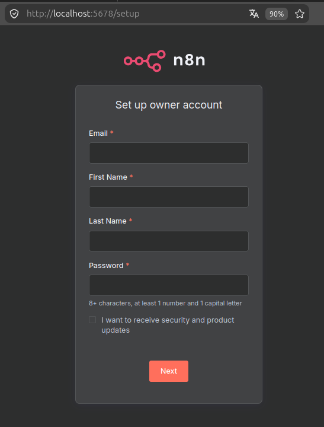

### Community-нода GigaChat

**Settings → Community nodes → Install a community node**. Пакет:

```text
n8n-nodes-gigachat
```

Подтвердите риск и дождитесь **Installing**. При необходимости обновите страницу.

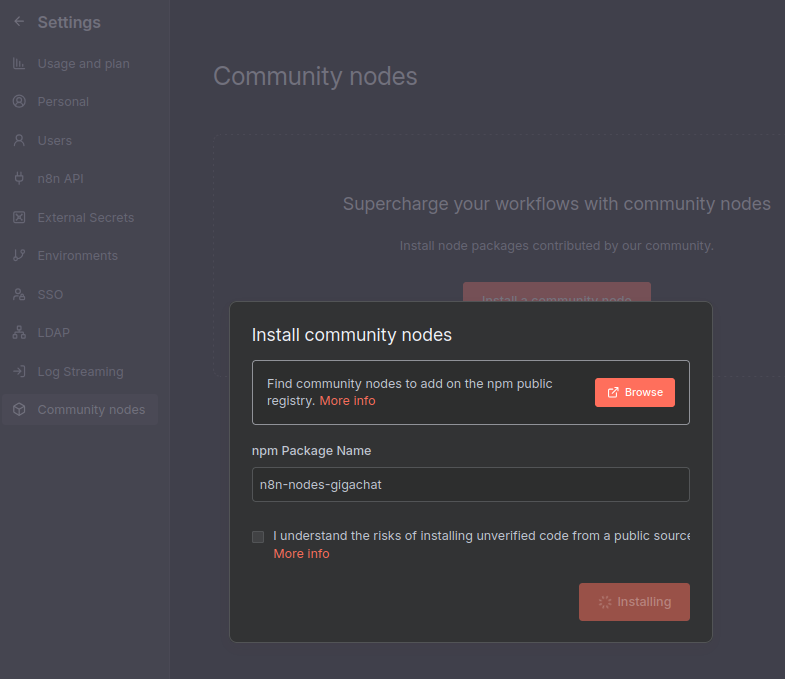

### Ключ GigaChat

**Credentials → Add credential**, поиск `GigaChat`, **Continue**.

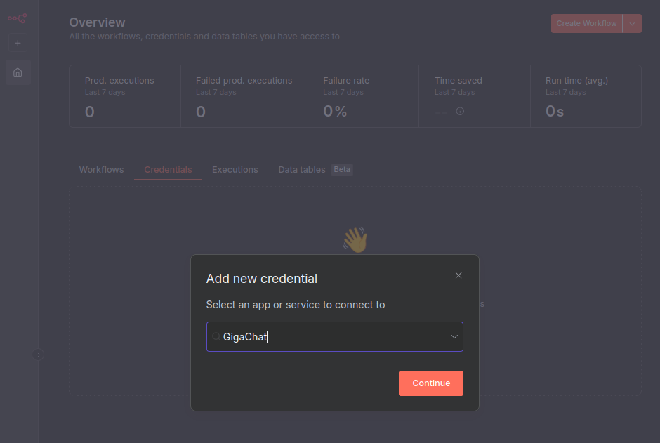

Вставьте **Authorization key**. **Scope** для личного кабинета обычно `GIGACHAT_API_PERS`. URL по умолчанию не меняйте без нужды:

- Base Auth URL: `https://ngw.devices.sberbank.ru:9443`
- Base Backend URL: `https://gigachat.devices.sberbank.ru/api/v1`

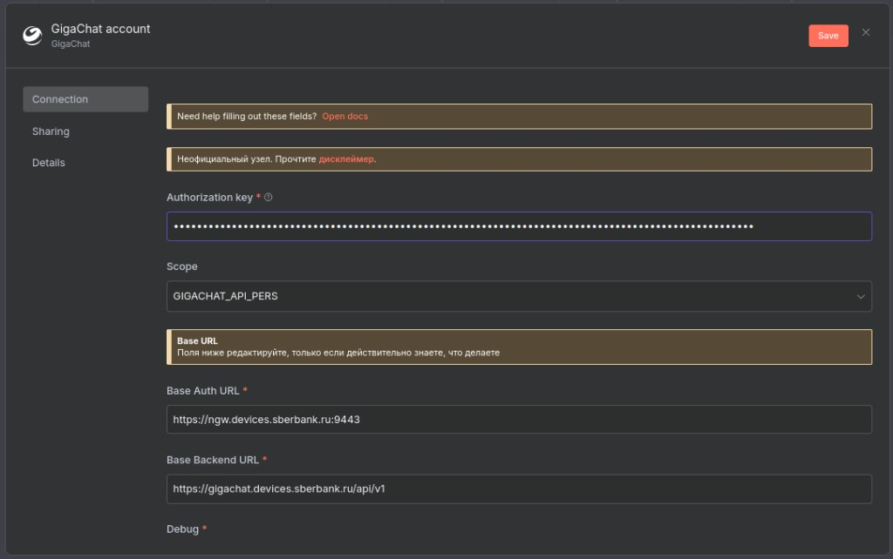

Сохраните. Ожидается **Connection tested successfully**.

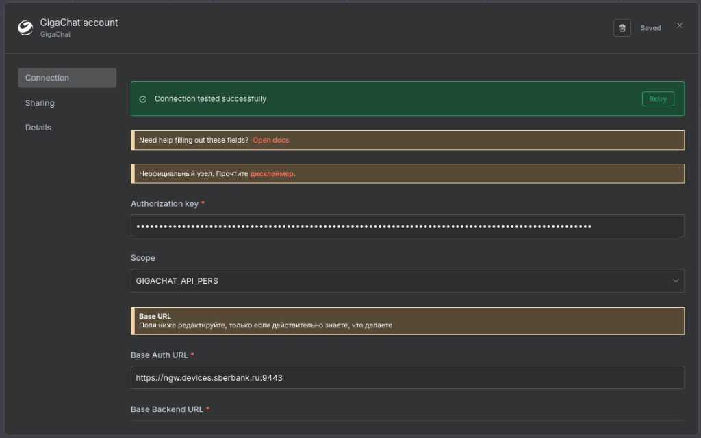

Если тест падает — ключ, scope и исходящий HTTPS из контейнера `ariz-n8n` (прокси, брандмауэр Windows).

### Импорт workflow

**Import from File** → `n8n_workflows\ariz_85_v.json`.

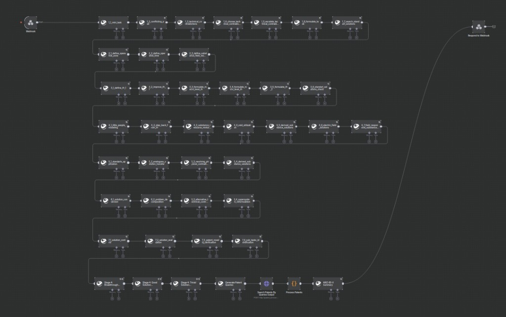

На всех нодах GigaChat выберите credentials, уберите замечания, сохраните, включите **Active**.

### Webhook URL

Нода **Webhook**. Для чата нужен **Production URL**: `http://localhost:5678/webhook/<uuid>`.

На скрине выбран **Test URL** (`…/webhook-test/…`) — для отладки; тогда каждый раз **Listen for test event**. Для OpenWebUI уберите `-test`, workflow — **Active**.

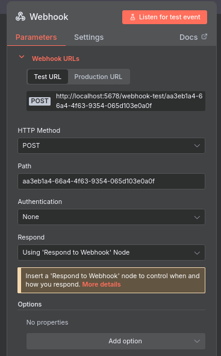

OpenWebUI в Docker-сети: в Valves хост `n8n`, не `localhost`:

```text
http://n8n:5678/webhook/aa3eb1a4-66a4-4f63-9354-065d103e0a0f
```

UUID — из поля **Path** вашей ноды Webhook.

---

## Настройка OpenWebUI

1. http://localhost:3000 — создайте администратора.
2. Отключите автогенерацию заголовка чата, продолжения и тегов — иначе ответы АРИЗ засоряются служебным текстом.
3. **Admin Panel → Functions** (иногда Workspace → Functions). Создайте **Pipe**.
4. Вставьте содержимое `openwebui_functions\ariz_85_v.py`.
5. **Valves:**
   - **N8N_WEBHOOK_URL** — Production URL с хостом `n8n`, без `webhook-test`.
   - **TIMEOUT** — например `600` (секунды на весь webhook). В коде по умолчанию 120 — мало для полного АРИЗ.
6. Включите функцию.
7. Новый чат → эта функция → опишите задачу и ждите (минуты).

---

## Загрузка патентов

Поиск опционален. Чтобы заполнить Qdrant:

1. [Google Patents](https://patents.google.com/) (часто нужен VPN) → **Download (CSV)**.

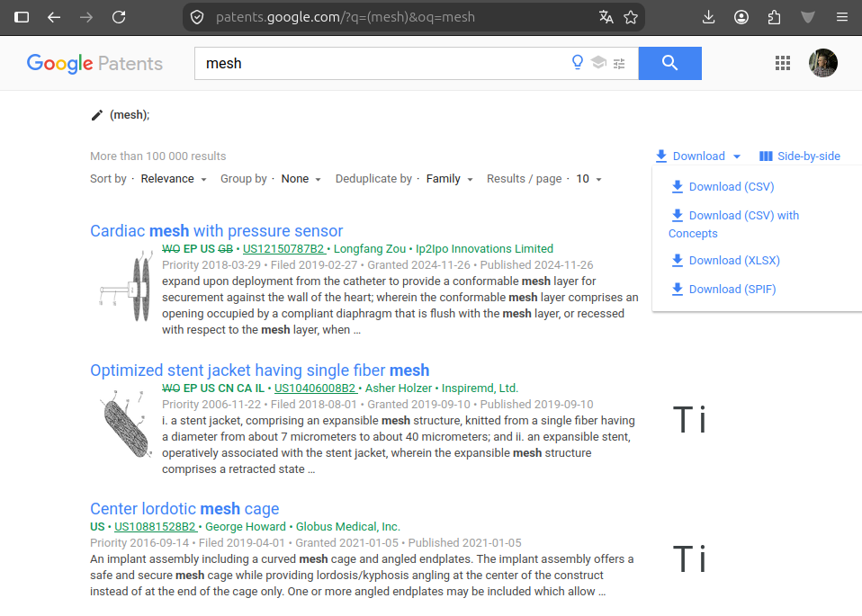

2. http://localhost:8000/docs → **POST /load_csv** → файл → **Execute**. Первый раз может долго качаться модель эмбеддингов.

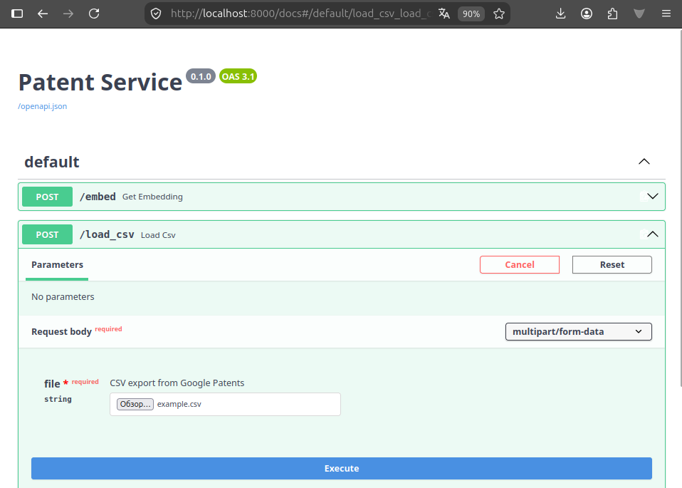

3. Ответ `202` с `task_id`:

```json
{
  "message": "CSV load started",
  "task_id": "5f224275-6734-4074-bde8-b179b42aed2a",
  "status_endpoint": "/load_status/5f224275-6734-4074-bde8-b179b42aed2a"
}
```

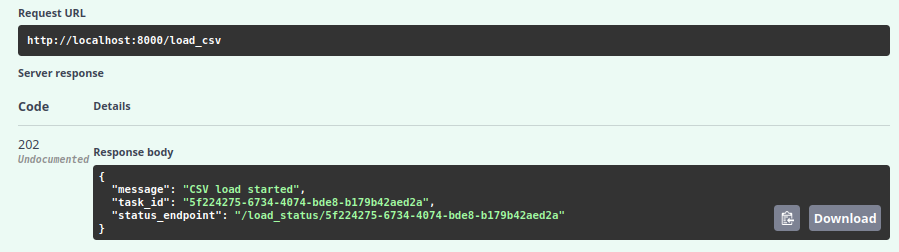

4. **GET /load_status/{task_id}** до `"status": "completed"`.

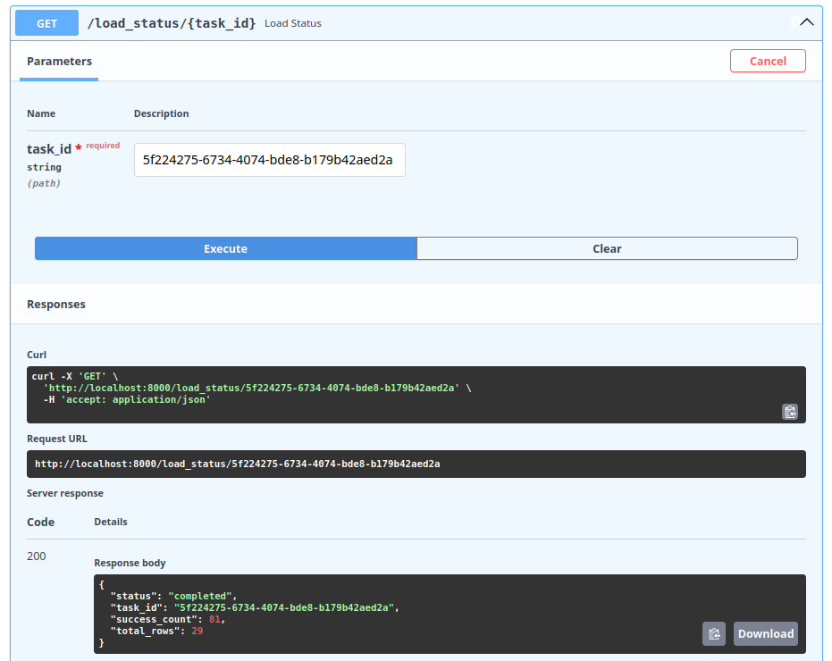

Подробнее: [GOOGLE_PATENTS.md](GOOGLE_PATENTS.md).

---

## Работа

Чат с функцией ARIZ: конфликт, ограничения, что нельзя менять.

Axios `timeout of 30000ms exceeded` — лимит ноды GigaChat. В compose уже есть `GIGACHAT_TIMEOUT=300`; пересоздайте n8n (`docker compose up -d n8n --force-recreate`) и поднимите TIMEOUT в Valves.

---

## Команды (PowerShell, папка проекта)

```powershell
docker compose up -d
docker compose ps
docker compose logs n8n --tail 50
docker compose down
```
